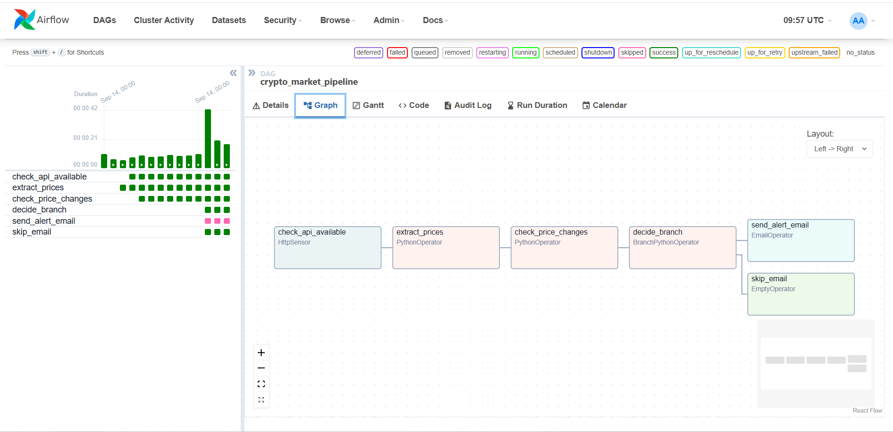

# Crypto Market Monitoring & Alerting Pipeline (Apache Airflow)

An orchestrated Airflow pipeline that monitors live cryptocurrency prices daily, detects significant price swings, and automatically sends an email alert — built to practice production-style orchestration concepts (Sensors, Variables, Pools, Branching, Email operators) rather than just running scripts manually.

---

## Project Goal

Manually running a script to check prices doesn't scale, doesn't recover from a down API on its own, and doesn't tell you when something worth noticing happens. This project automates that entire loop:

> **Check that the data source is up, pull live prices, compare them to the last run, and only notify a human when something actually changed enough to matter.**

---

## Pipeline (DAG) Overview



```
check_api_available (HttpSensor)
        ↓
   extract_prices (PythonOperator)
        ↓
check_price_changes (PythonOperator)
        ↓
   decide_branch (BranchPythonOperator)
      ↓         ↓
send_alert_email   skip_email
 (EmailOperator)   (EmptyOperator)
```

1. **check_api_available** — an `HttpSensor` pings the CoinGecko API before anything else runs, so a temporarily-down source fails safely instead of crashing the pipeline
2. **extract_prices** — pulls current USD prices for a configurable list of coins
3. **check_price_changes** — compares today's prices against the last recorded run and flags any coin that moved beyond a configurable threshold
4. **decide_branch** — a `BranchPythonOperator` routes the DAG down one of two paths depending on whether any alerts were found
5. **send_alert_email** / **skip_email** — only one of these two tasks actually runs per execution, based on the branch decision

---

## Airflow Concepts Used

| Concept | How it's used here |
|---|---|
| **DAG** | Defines the full task sequence and daily schedule |
| **Sensor** (`HttpSensor`) | Confirms the price API is reachable before extraction begins |
| **Variables** | `crypto_coins` (tracked coin list) and `alert_threshold_percent` (alert sensitivity) are stored in Airflow and editable from the UI — no code changes needed to reconfigure the pipeline |
| **XCom** | Passes extracted price data and detected alerts between tasks |
| **BranchPythonOperator** | Routes execution to an email or a no-op task depending on whether a real alert condition was met |
| **EmailOperator** | Sends the actual alert email via SMTP, configured through environment variables |

---

## Security Note

SMTP credentials (email address and app password) are read from environment variables via a `.env` file, which is excluded from version control with `.gitignore` — the same discipline applied after finding a hardcoded API key in an earlier project. Secrets never appear directly in the committed `docker-compose.yaml`.

---

## Tech Stack

- **Apache Airflow 2.9** (via Docker Compose)
- **Python** — `requests` for the CoinGecko API
- **CoinGecko API** — free, no API key required
- **Docker** — containerized Airflow deployment

---

## How to Run

1. Install Docker Desktop and make sure it's running
2. Clone this repo and, from the project folder, run:
   ```bash
   docker compose up airflow-init
   docker compose up
   ```
3. Create a `.env` file (not included — see `.env.example`) with your own SMTP credentials
4. Open `http://localhost:8080` (default login: `airflow` / `airflow`)
5. Under **Admin → Variables**, set:
   - `crypto_coins` — comma-separated coin IDs, e.g. `bitcoin,ethereum,solana`
   - `alert_threshold_percent` — e.g. `5`
6. Under **Admin → Connections**, add an HTTP connection `coingecko_api` pointing to `https://api.coingecko.com`
7. Trigger the `crypto_market_pipeline` DAG from the UI

---

## Project Structure

```
crypto-airflow-pipeline/
├── dags/
│   └── crypto_pipeline.py
├── docker-compose.yaml
├── .env.example
├── .gitignore
├── dag_graph.png
└── README.md
```

---

## Next Steps

- [ ] Add a `Pool` to explicitly limit concurrent API requests and avoid rate limits
- [ ] Store price history in a proper database instead of a local JSON file
- [ ] Add retries and alerting for pipeline failures themselves, not just price alerts

---

## About

Built to move beyond manually-run ETL scripts and practice real pipeline orchestration: scheduling, failure-aware sensing, conditional branching, and automated notification — the operational layer that sits on top of the extract/transform/load logic from my earlier projects.
